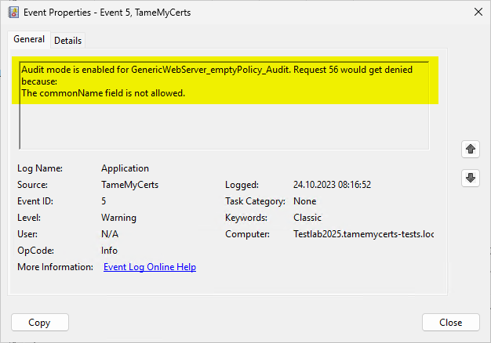

## Audit only mode {#audit-only-mode}

> Applies to **online** and **offline** certificate templates.

TameMyCerts supports an Audit-only mode, in which certificate requests get allowed regardless of the verification result. This helps by sharpending policies before applying them to existing deployments. If a certificate request would be denied in regular mode, TameMyCerts will [log this to the event log](#logs) of the certification authority to allow administrators further research.



### Configuring

You enable Audit only mode by configuring the **AuditOnly** directive.

```xml
<AuditOnly>true</AuditOnly>
```