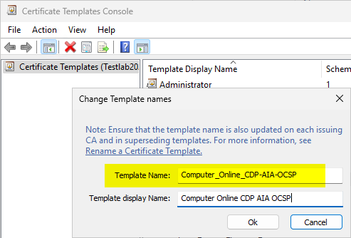
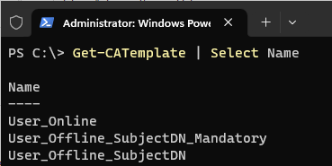

# Configuring the TameMyCerts policy module {#configuring}

The TameMyCerts policy module uses eXtended Markup Language (XML) files to describe what shall be done with incoming certificate requests for a given certificate template. This approach has the benefit that changes can easily be tracked with version control systems like Git and annotated with inline comments.

## Creating a policy configuration file

Create a policy configuration file in XML format for each certificate template you want to apply a policy for in the folder you specified during [Installing the TameMyCerts policy module](#installing).


> Please ensure the file is encoded as UTF-8 if you plan to support special characters like german "Umlauts".

Name the file exactly as the certificate template ("cn" LDAP attribute) that shall get examined.

For example, if your certificate template is named _"TameMyCertsWebServer"_, you create a policy configuration file named _"TameMyCertsWebServer.xml"_. You can get the object name of the certificate template from the certificate template management console or via Windows PowerShell.

> Note that certificate template names allow several characters that are not valid for file names (e.g. "<>|*?\\/). If you have such a template, simply omit these characters when naming the file.





Each policy configuration file starts with a basic definition of a _CertificateRequestPolicy_ as shown below:

```xml
<CertificateRequestPolicy xmlns:xsi="http://www.w3.org/2001/XMLSchema-instance" xmlns:xsd="http://www.w3.org/2001/XMLSchema">
  <!-- Directives go here -->
</CertificateRequestPolicy>
```

> The distribution package of TameMyCerts contains various example files (<https://github.com/Sleepw4lker/TameMyCerts/tree/main/examples>) to get started with the most common use cases.

The policy configuration files get loaded when an incoming certificate request is processed. Therefore it is **not** necessary to restart the certification authority service after a policy configuration file has been created or changed. As long as the configuration file does not change, subsequent certificate requests for the same certificate template [will be served from an internal cache](#policy-cache).

> If TameMyCerts is not able to parse the policy configuration file (e.g. because of a syntax error), the certificate request gets denied and an entry is written into the servers [event log](#logs), pointing to the possible cause of the issue.

You can now configure the file as desired. Some of the settings described in subsequent chapters apply only to offline requests and will have no effect when configured for online certificate templates.

### Examples

A basic policy configuration file that restricts all certificate request for a given offline certificate template to having a _commonName_ of "Hello World", and nothing else. All certificate requests that do not comply with these settings will get denied.

```xml
<CertificateRequestPolicy xmlns:xsi="http://www.w3.org/2001/XMLSchema-instance" xmlns:xsd="http://www.w3.org/2001/XMLSchema">
  <Subject>
    <SubjectRule>
      <Field>commonName</Field>
      <Mandatory>true</Mandatory>
      <Patterns>
        <Pattern>
          <Expression>^Hello World$</Expression>
        </Pattern>
      </Patterns>
    </SubjectRule>
  </Subject>
</CertificateRequestPolicy>
```