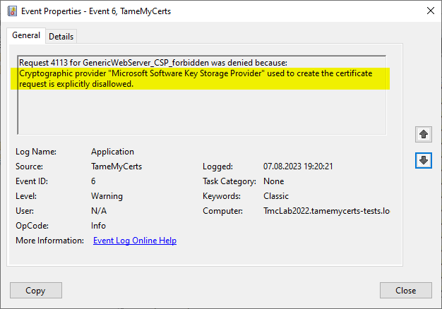
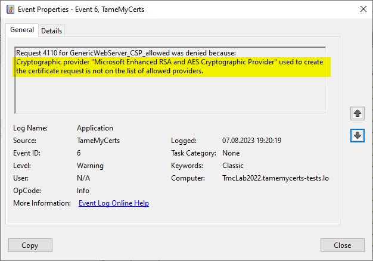

## Configuring rules to restrict cryprographic providers creating a CSR {#csp-rules}

> Applies to **online** and **offline** certificate templates.

Certificate requests can contain information about which cryptographic provider (<https://www.gradenegger.eu/en/basics-cryptographic-service-provider-csp-and-key-storage-provider-ksp/>) was used to create the key pair. This information can be used to apply a policy which providers are permitted to get a certificate issued and which are not.

> Please be aware that only certificate requests that have been made with the Microsoft API (e.g. Autoenrollment, MMC, certreq, PSCertificateEnrollment (<https://www.powershellgallery.com/packages/PSCertificateEnrollment>) and similar apps) will contain information about the provider that was used to create the certificate request.

> Please be also aware that the provider information may potentially be manipulated by the enrollee during the request creation process. Therefore, this method is less secure than serious attestation methods for TPMs (<https://learn.microsoft.com/en-us/windows-server/identity/ad-ds/manage/component-updates/tpm-key-attestation>) or Smartcards.





### Configuring

The **AllowedCryptoProviders** directive contains a list of one or more Cryptographic Service Provider (CSP) or Key Storage Provider (KSP) names that are permitted for the creation of the certificate requests private key. For example, you could configure a certificate template to use the machines Trusted Platform Module (TPM) by specifying the Microsoft Platform Crypto Provider and a fallback to the Microsoft Software Key Storage Provider, whereas the policy for TameMyCerts would only permit requests for the Microsoft Platform Crypto Provider to be issued. This way, you could identify machines where the TPM is in a nonfunctional state by evaluating denied certificate requests.

The **DisallowedCryptoProviders** directive contains a list of one or more Cryptographic Service Provider (CSP) or Key Storage Provider (KSP) names that are disallowed for the creation of the certificate requests private key.

> Configured values are processed case-insensitive.

Key Storage Providers shipped with Windows include:

- Microsoft Passport Key Storage Provider
- Microsoft Platform Crypto Provider
- Microsoft Smart Card Key Storage Provider
- Microsoft Software Key Storage Provider

Cryptographic Service Provider shipped with Windows include:

- Microsoft Base Cryptographic Provider v1.0
- Microsoft Base DSS and Diffie-Hellman Cryptographic Provider
- Microsoft Base DSS Cryptographic Provider
- Microsoft Base Smart Card Crypto Provider
- Microsoft DH SChannel Cryptographic Provider
- Microsoft Enhanced Cryptographic Provider v1.0
- Microsoft Enhanced DSS and Diffie-Hellman Cryptographic Provider
- Microsoft Enhanced RSA and AES Cryptographic Provider
- Microsoft RSA SChannel Cryptographic Provider
- Microsoft Strong Cryptographic Provider

### Examples

Some providers are whitelisted and all others are forbidden:

```xml
<AllowedCryptoProviders>
  <string>Microsoft Platform Crypto Provider</string>
  <string>Microsoft Software Key Storage Provider</string>
</AllowedCryptoProviders>
```

Some providers are blacklisted and all others are allowed:

```xml
<DisallowedCryptoProviders>
  <string>Microsoft Platform Crypto Provider</string>
</DisallowedCryptoProviders>
```