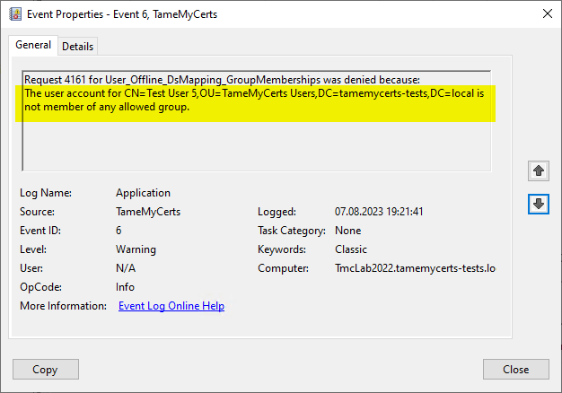
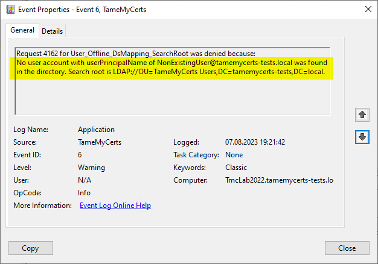
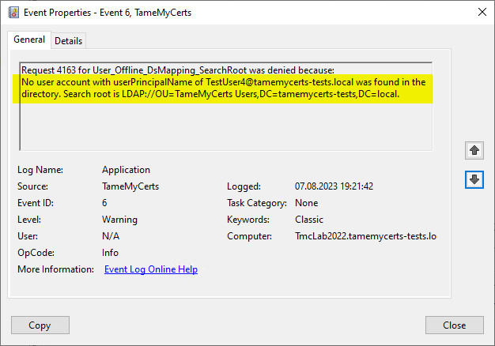
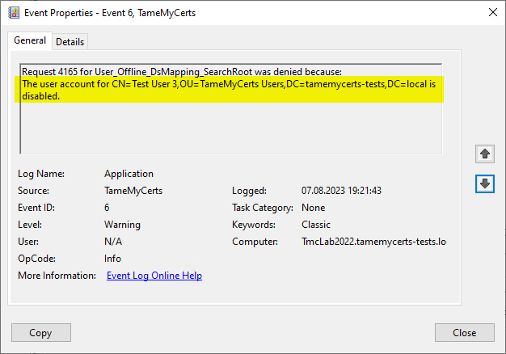

## Configuring directory services mapping {#ds-mapping}

> Applies to **online** and **offline** certificate templates.

Directory Services mapping allows you to map an identity in a certificate request back to an Active Directory object. This way, a variety of policies can be applied, containing:

- Verify that there is a user or computer object to which the certificate request belongs.
- Verify that the object is not disabled.
- Verify that the object is located in a specific Organizational Unit (OU).
- Verify that the object is member of a specific security group, or that it is **not** member of a specific security group.
- Enable features that depend on DS mapping like supplementing the [Security Identifier (SID) certificate extension](#sid-extension) or [Modifying the Subject Distinguished Name](#modify-subject-dn) or [Subject Alternative Name](#modify-san) with values from Active Directory.









### Configuring

> When using DS mapping with an **offline** certificate template, Directory Services mapping setting get processed after [Rules for the Subject Distinguished Name (Subject Distinguished Name)](#subject-rules) and [Rules for the Subject Alternative Name (SAN)](#san-rules), so ensure you have these configured as well.

> Note that for Directory Services mapping to work properly, the certification authority server must be member of the Built-in `Pre-Windows 2000 Compatible Access` security group. By default, certification authorities are implicitly members of this group via their membership in the `Cert Publishers` security group.

Rules for Directory Mapping get specified within the `DirectoryServicesMapping` node.

When using an **online** certificate template, the object category as well as certificate and directory services attributes are determined automatically.

When using an **offline** certificate template, the certificate attribute that was chosen for DS mapping is mandatory to occur in the certificate request and **must** occur only once. Ensure this via an appropriate [Subject rules](#subject-rules) or [Subject Alternative Name rules](#san-rules).

> TameMyCerts is only able to map exactly **one** of the requested identities to an Active Directory object. Usually a certificate request contains multiple fields that can be used as identity (e.g. commonName and userPrincipalName). Which field of the issued certificate is used by to determine the certificate holders identity depends on the verifying application. You should therefore overwrite other identites by either [modifying the Subject DN](#modify-subject-dn) or [the Subject Alternative Name](#modify-san) with values from Active Directory (e.g. map _userPrincipalName_ and overwrite _commonName_ from the mapped Active Directory object to ensure strict rule enforcement.

|Parameter|Mandatory|Description|
|---|---|---|
|`Action`|no|Specifies what should happen with the certificate request in case a matching object was found in the directory. Can be `Allow`, `Deny`, or `Continue`. `Allow` will cause the request getting denied when no object could be found. `Deny` will cause the request getting denied when an object was found. `Continue` will cause the request not getting denied in both cases. Defaults to `Allow`.|
|`CertificateAttribute`|no|The field which is taken from the certificate request as the identity to map to a corresponding Active Directory object. May contain any identity that is listed above for either the Subject Distinguished Name, or for the Subject Alternative Name. Defaults to `userPrincipalName`. Automatically determined for **online** certificate templates.|
|`DirectoryServicesAttribute`|no|The attribute of the Active Directory object that must match the certificate attribute. May be `cn`, `name`, `sAMAccountName`, `userPrincipalName` or `dNSHostName`. Defaults to `userPrincipalName`. Automatically determined for **online** certificate templates.|
|`ObjectCategory`|no|The category of the Active Directory object to be searched for. May be `computer` or `user`. Defaults to `user` for _offline_ certificate templates. Automatically determined for _online_ certificate templates.|
|`SearchRoot`|no|The distinguished name of the LDAP path the search for the Active Directory object shall start from. Defaults to using the global catalog for the entire forest.|
|`CustomAttributes`|no|Specifies a list of custom Active Directory object attributes to load for the mapped object. Mind that the properties must be single-value and of a type that can be converted into a string.|
|`AllowedSecurityGroups`|no|A list of distinguished names of security groups the account must be member of (request gets denied if it **is not** member of at least one of them).|
|`DisallowedSecurityGroups`|no|A list of distinguished names of security groups the account must **not** be member of (request gets denied if it **is** member of at least one of them).|
|`AllowedOrganizationalUnits`|no|A list of distinguished names of organizational units the account must be member of (request gets denied if it **is not** member of at least one of them).|
|`DisallowedOrganizationalUnits`|no|A list of distinguished names of organizational units the account must **not** be member of (request gets denied if it **is** member of at least one of them).|
|`PermitDisabledAccounts`|no|Permits certificates to get issued even if the Active Directory object is disabled.|
|`SupplementServicePrincipalNames`|no|Set to `true` to supplement DNS names found in the ServicePrincipalName attribute of the mapped AD object. See [Supplementing Service Principal Names](#supplement-spns) for more details.|
|`DirectoryObjectRules`|no|You can define one or more `DirectoryObjectRule` directives. See [Configuring directory object rules](#ds-object-rules) for further reference.|
|`AddSidUniformResourceIdentifier`|no|Adds the security identifier (SID) of the mapped AD object into the Subject Alternative Name (SAN) certificate extension of the issued certificate. The entry will be in form of a `uniformResourceIdentifier` (`tag:microsoft.com,2022-09-14:sid:<value>`). This "strong" mapping method was introduced by Microsoft in April 2023 (<https://techcommunity.microsoft.com/t5/ask-the-directory-services-team/preview-of-san-uri-for-certificate-strong-mapping-for-kb5014754/bc-p/3794144#M965>).|

> The `AllowedOrganizationalUnits` and `DisallowedOrganizationalUnits` directives match also for nested organizational units. E.g. if you whitelist `DC=intra,DC=tamemycerts,DC=com` and the object resides in `OU=Users,DC=intra,DC=tamemycerts,DC=com`, this will match as well.
> If you configure TameMyCerts to add the SID uniform resource identifier, you should ensure that the resulting certificate will contain a Subject Alternative Name of type `dNSName` (for mapped computer objects) or _userPrincipalName_ (for mapped user objects) as this will be used to map the certificate to the AD object during authentication. You can either achieve this by having the field being put into the certificate request (and [governing requested certificate content](#san-rules)), or [add the Subject Alternative Name from Active Directory](#modify-san) via [Directory Services mapping](#ds-mapping).

Please be aware of the following limitations:

- The `sAMAccountName` Active Directory attribute is only unique per Domain, but not on Forest level. TameMyCerts denies a certificate request if more than one account with the same identifier is found. Avoid this by either using unique directory attributes, or by specifying the `SearchRoot` parameter accordingly.
- The `userPrincipalName` attribute may not be populated by default for user accounts.
- You must escape LDAP-reserved characters (e.g. `=`, `,`, `\`) with a backward slash (`\`), if present, for `SearchRoot`, `AllowedSecurityGroups` and `DisallowedSecurityGroups`.
- The certification authority needs LDAP network access to all Domain Controllers that are involved in the DS mapping process. In addition, LDAP Global Catalog (GC) access is required as well when `SearchRoot` is not explicitly specified, or nested Group Memberships are going to be resolved. Consult the official Microsoft documentation (<https://learn.microsoft.com/en-us/troubleshoot/windows-server/identity/config-firewall-for-ad-domains-and-trusts>) for further information.

### Resolving of Group Memberships

By default, TameMyCerts resolves nested Group Memberships for mapped objects.

This allows to use the **primary group** of a mapped Active Directory object (e.g. `Domain Users`, `Domain Guests`) for use with the `AllowedSecurityGroups` and `DisallowedSecurityGroups` directives, and group memberships from any domain can be resolved.

However, as TameMyCerts will use the `msds-TokenGroupNames` (<https://learn.microsoft.com/en-us/openspecs/windows_protocols/ms-adts/1d810083-9741-4b0a-999b-30d9f2bc1f95>) Active Directory Attribute, which is only available on Windows Server 2016 and newer Domain Controllers, if TameMyCerts cannot retrieve the `msds-TokenGroupNames` attribute for a mapped object, certificate requests will get denied due to security reasons.

Also, bear in mind that due to the limitation of the `msds-TokenGroupNames` attribute, the list of group memberships will only contain groups of the **same Domain** the user is inside. Therefore, it is recommended to prefer a whitelisting approach to not miss out on any important group memberships that might not get resolved due to these limitations.

### Disabling resolving of nested Group Memberships

It is possible to disable resolving nested Group Memberships by enabling the `TMC_DONT_RESOLVE_NESTED_GROUP_MEMBERSHIPS` [global flag](#global-settings). TameMyCerts will then use the `MemberOf` (<https://learn.microsoft.com/en-us/openspecs/windows_protocols/ms-ada2/cc24555b-61c7-49a2-9748-167b8ce5a512>) attribute (against the mapped accounts domain) to determine Group Memberships of mapped objects.

Make sure you understand the following limitations when enabling this setting:

- It **will** allow to use Domain Controllers older than Windows Server 2016.
- It is **not** possible to use the **primary group** of a mapped Active Directory object (e.g. `Domain Users`, `Domain Guests`) for use with the `AllowedSecurityGroups` and `DisallowedSecurityGroups` directives.
- The mapped Active Directory object must be an **explicit** (no nested groups) member of the configured security groups.
- It is only possible to define groups that are **in the same domain** as the mapped account.

### Examples

Enabling the mapping with default values for `user` objects in an _offline_ template:

```xml
<DirectoryServicesMapping />
```

Enabling the mapping with default values for `user` **and** `computer` objects in an _online_ template:

```xml
<DirectoryServicesMapping />
```

Enabling the mapping with default values for `computer` objects in an _offline_ template:

```xml
<DirectoryServicesMapping>
  <CertificateAttribute>dNSName</CertificateAttribute>
  <DirectoryServicesAttribute>dNSHostName</DirectoryServicesAttribute>
  <ObjectCategory>computer</ObjectCategory>
</DirectoryServicesMapping>
```

Specifying an LDAP path as search root:

```xml
<DirectoryServicesMapping>
  <!-- other directives have been left out for simplicity -->
  <SearchRoot>OU=TameMyCerts Users,DC=tamemycerts,DC=local</SearchRoot>
</DirectoryServicesMapping>
```

Specifying an LDAP path as search root with escaping of LDAP-reserved characters:

```xml
<DirectoryServicesMapping>
  <!-- other directives have been left out for simplicity -->
  <SearchRoot>OU=Users\,Computers\,and others,DC=tamemycerts,DC=local</SearchRoot>
</DirectoryServicesMapping>
```

Specifying additional custom Attributes to load for the mapped object, and write them into the issued certificate:

```xml
<DirectoryServicesMapping>
  <CustomAttributes>
    <string>myCustomAttribute1</string>
    <string>myCustomAttribute2</string>
  </CustomAttributes>
  <OutboundSubject>
    <OutboundSubjectRule>
      <Field>stateOrProvinceName</Field>
      <Value>{ad:myCustomAttribute1}</Value>
      <Mandatory>true</Mandatory>
      <Force>true</Force>
    </OutboundSubjectRule>
    <OutboundSubjectRule>
      <Field>organizationalUnitName</Field>
      <Value>{ad:myCustomAttribute2}</Value>
      <Mandatory>true</Mandatory>
      <Force>true</Force>
    </OutboundSubjectRule>
  </OutboundSubject>
</DirectoryServicesMapping>
```

Permitting the issuance of certificates for disabled accounts:

```xml
<DirectoryServicesMapping>
  <!-- other directives have been left out for simplicity -->
  <PermitDisabledAccounts>true</PermitDisabledAccounts>
</DirectoryServicesMapping>
```

Filtering on security group memberships of a mapped object:

```xml
<DirectoryServicesMapping>
  <!-- other directives have been left out for simplicity -->
  <AllowedSecurityGroups>
    <string>CN=An allowed Group,DC=tamemycerts,DC=local</string>
  </AllowedSecurityGroups>
  <DisallowedSecurityGroups>
    <string>CN=A forbidden Group,DC=tamemycerts,DC=local</string>
  </DisallowedSecurityGroups>
</DirectoryServicesMapping>
```

Filtering on Organizational Unit placement of a mapped object:

```xml
<DirectoryServicesMapping>
  <!-- other directives have been removed for this example -->
  <AllowedOrganizationalUnits>OU=some-allowed-OU,DC=tamemycerts,DC=local</AllowedOrganizationalUnits>
  <DisallowedOrganizationalUnits>OU=some-disallowed-OU,DC=tamemycerts,DC=local</DisallowedOrganizationalUnits>
</DirectoryServicesMapping>
```

Adding the SID uniform resource identifier to the certificates SAN:

```xml
<DirectoryServicesMapping>
  <!-- other directives have been left out for simplicity -->
  <AddSidUniformResourceIdentifier>true</AddSidUniformResourceIdentifier>
</DirectoryServicesMapping>
```

This policy will deny a certificate request, should a matching object be found in the directory.

```xml
<DirectoryServicesMapping>
  <Action>Deny</Action>
  <!-- other directives have been left out for simplicity -->
</DirectoryServicesMapping>
```

> For an example on how to add the SID **certificate extension** to an issued certificate, see section "[Working with the SID certificate extension](#sid-extension)".
