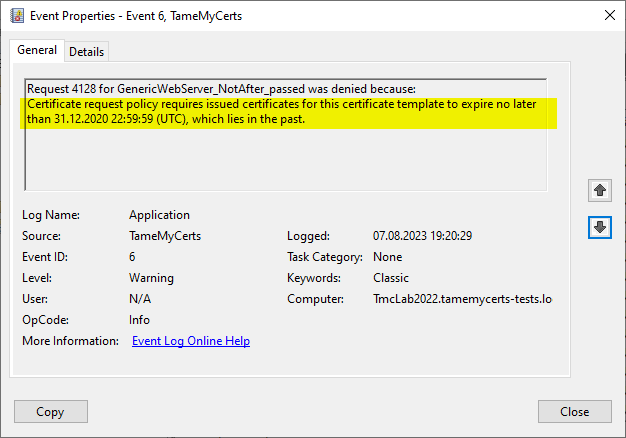

## Configuring a fixed expiration date for all issued certificates {#enddate}

> Applies to **online** and **offline** certificate templates.

TameMyCerts allows to configure certificates issued for a specific certificate template to expire at an exactly configured point in time. This can be useful in scenarios where you want to ensure that e.g. certificates with weak keys get phased out until a specified point in time.

The behavior is as follows:

-   If the configured expiration date exceeds the regular certificate expiration date as configured in the certificate template (or certificate authority), no change is made to the issued certificate.

-   If the configured expiration date has not yet passed but is less than the regular expiration date as configured in the certificate template (or certifificate authority), the expiration date is set to the configured point in time.

-   If the configured expiration date has passed, certificate requests for the given certificate template get denied.



### Configuration

You configure the expiration date with the **NotAfter** directive in your policy configuration file.

The time gets specified as an ISO 8601 compliant string in the following syntax:

```
'yyyy'-'MM'-'dd'T'HH':'mm':'ss'.'fffffffzzz'
```

> See the original Microsoft documentation (<https://learn.microsoft.com/en-us/dotnet/standard/base-types/standard-date-and-time-format-strings>) for further explanation.

### Examples

All certificates will expire on Dec 31, 2022 23:59:59 Europe/Berlin (UTC+1) time. After that date has passed, all certificate requests for this template get denied.

```xml
<NotAfter>2022-12-31T23:59:59.0000000+01:00</NotAfter>
```