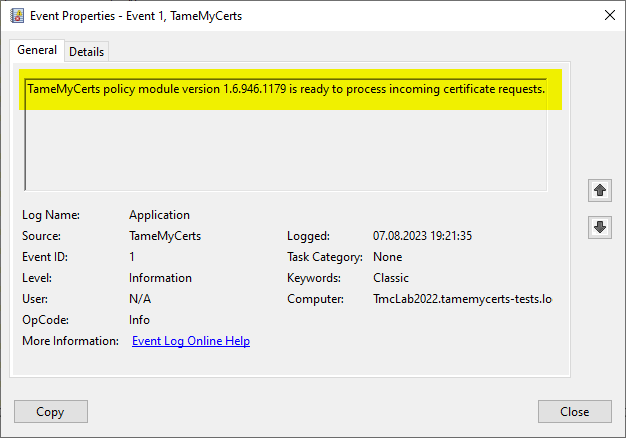

## Event ID 1 {#event-id-1}

- Event Log: Application
- Event Source: TameMyCerts
- Event Type: Information
- Required certification authority LogLevel: 4 (CERTLOG_VERBOSE)

### Event Sample

```
{0} policy module version {1} is ready to process incoming certificate requests.
```

- Placeholder {0} will contain the policy module name.
- Placeholder {0} will contain the policy module version.

### Event Description

Occurs if the Windows Default policy was successfully loaded and TameMyCerts is ready to process incoming requests.


