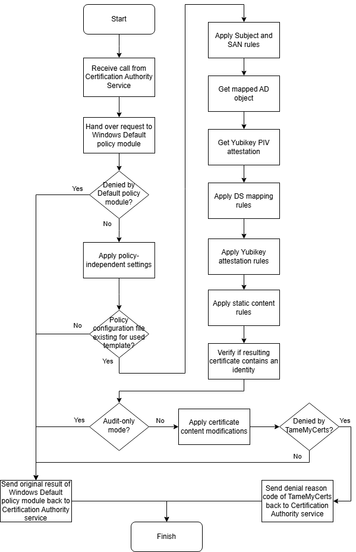

## How TameMyCerts works {#how-it-works}

The caveat in developing a custom policy module is that there can only be one module active at a time. Usually this means that all the functionality of the Windows Default policy module would have to be re-implemented by the custom module, which is complex and prone to errors.

TameMyCerts solves the issue: It shims the Windows Default policy module, which means all the original functionality is preserved, but additional checks can be performed afterwards.

TameMyCerts passes incoming certificate requests to the Windows Default policy module and only gets active afterwards, if a [configuration](#configuring) has been made. This means all certificate templates that don’t have a policy configuration file specified are completely left untouched and behave exactly as without having TameMyCerts installed.

This approach was adopted from a code sample that initially was published by Microsoft (a mirror can be found at <https://github.com/Sleepw4lker/capolmod>) and is in alignment with their recommendations for the development of custom policy modules (<https://learn.microsoft.com/en-us/previous-versions/windows/it-pro/windows-server-2003/cc783853(v=ws.10)#certificate-services-architecture>).

### How TameMyCerts applies its rules to certificate requests

You configure your certificate templates as usual. You then define your rules in eXtended Markup Language (XML) files, one per certificate template you want to "tame". During installation, you point TameMyCerts to the path where it shall search for your configuration files. If there is no configuration file defined for a given certificate template, TameMyCerts does not apply any additional logic, thus preserving the original behavior of the Windows Default policy module.
