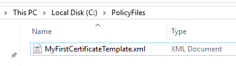
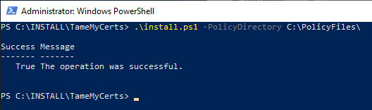
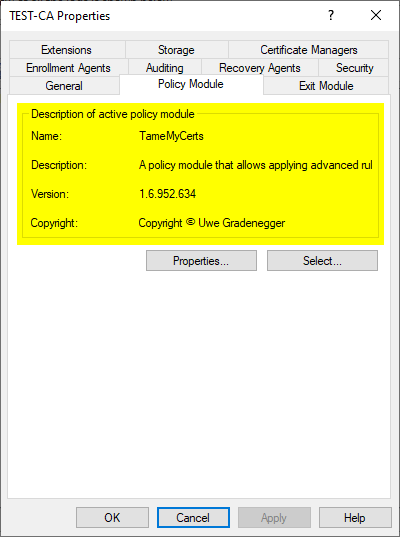

# Installing the TameMyCerts policy module {#installing}

> Ensure that the [prerequisites](#prerequisites) are being met by the destination machine prior to installing TameMyCerts.

If you signed up for a maintenance contract, you get a ZIP file containing the module binary as well as an installer script and some example configuration files to get you started.

You will probably have to unblock the files before you can call the installer script. This can be achieved with the following command, executed on the path where the files have been unzipped.

```powershell
Get-ChildItem -Path * -Recurse | Unblock-File
```

To install the module, first create a directory on the certification authority where you intend to store the [policy configuration](#configuring) files.



Then run `install.ps1` as local Administrator. The script will register the module, create the required registry values and configure the policy module as the active one for the certification authority.

> The installation script restarts the certification authority service during installation and uninstallation.

You must specify the `-PolicyDirectory` Parameter which specifies the local path for the XML configuration files you define for each certificate template.

Example:

```powershell
.\install.ps1 -PolicyDirectory C:\PolicyFiles
```



Afterwards, TameMyCerts is automatically enabled as the active policy module, which can be reviewed in the properties dialog of the certification authority in the certification authority management console (certsrv.msc).



> As the policy module daisy-chains the Windows default policy module, it also uses all of its registry settings. Therefore, the install script copies this data from the Windows Default module registry key to a new one for the TameMyCerts policy module. Each change you perform with certutil commands that would configure the Windows Default policy module is now written to the TameMyCerts policy module registry key. Should you decide to uninstall it later on, [use the provided installer script as well](#uninstalling) to ensure the settings get copied back so that they stay consistent.