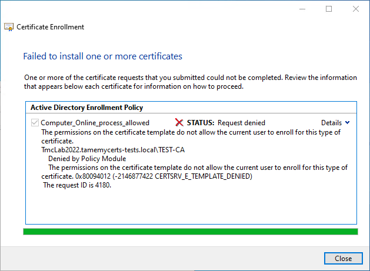
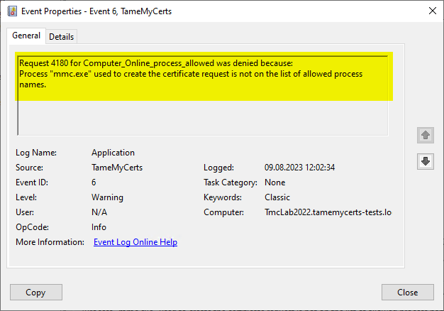
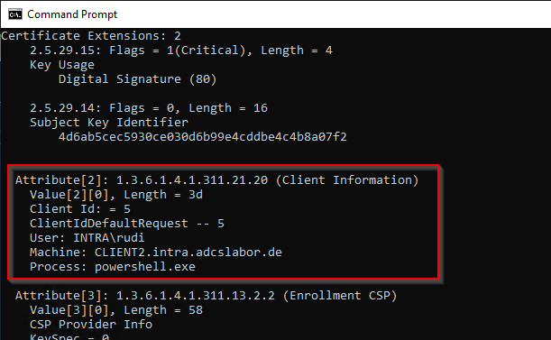

## Configuring rules to restrict processes creating a CSR {#process-rules}

> Applies to **online** and **offline** certificate templates.

Certificate requests can contain information about which process was used to create the key pair. This information can be used to apply a policy which processes are permitted to get a certificate issued and which are not (e.g. you want to allow only Autoenrollment but not manually requesting a certificate).

> Please be aware that only certficate requests that have been made with the Microsoft API (e.g. Autoenrollment, MMC, certreq, PSCertificateEnrollment (<https://www.powershellgallery.com/packages/PSCertificateEnrollment>) and similar apps) will contain information about the process that was used to create the certificate request.

> Please be also aware that the process information may be manipulated by the enrollee during the request creation process. This is therefore an enforcement on a best-effort basis.

> Reading the process names from the certificate request requires parsing the inline certificate request from the certification authority database. There are rare cases where this might fail. Should this happen, the process name is treated as nonexistent, which will lead to the request being denied if a proces rule is configured for the certificate template.





### Inspecting a certificate request for the process name

A certificate request can be inspected for the required process information by dumping it with the `certutil` command.

```batch
certutil -dump <request-file-name>
```



### Configuring

The `AllowedProcesses` directive contains a list of one or more process names that are permitted to get a certificate issued. For example, if you would like to restrict certificate enrollment for a certificate template to Autoenrollment only, you would permit "taskhostw.exe".

The `DisallowedProcesses` directive contains a list of one or more process names that are disallowed to get a certificate issued. For example, if you would like to deny certificate enrollment via certreq.exe, you could enter it here.

> Though both directives can be used at the same time, it is recommended to only use either _AllowedProcesses_ or _DisallowedProcesses_ in a policy.

Commonly used process names could be:

|Process name|Description|
|---|---|
|taskhostw.exe|Windows Autoenrollment|
|mmc.exe|Manual certificate enrollment with the Microsoft Management Console (MMC)|
|certreq.exe|Manual or scripted certificate enrollment with certreq.exe|
|powershell.exe|Manual or scripted certificate enrollment with a PowerShell module like PSCertificateEnrollment (<https://www.powershellgallery.com/packages/PSCertificateEnrollment>)|

> Configured values are processed case-insensitive.

### Examples

This configuration ensures that a certificate can **only** be requested via Windows AutoEnrollment (which is triggered by the Task Scheduler process, `taskhostw.exe`).

```xml
<AllowedProcesses>
  <string>taskhostw.exe</string>
</AllowedProcesses>
```

This configuration blacklists some common processes, but allows all others:

```xml
<DisallowedProcesses>
  <string>mmc.exe</string>
  <string>powershell.exe</string>
  <string>certutil.exe</string>
</DisallowedProcesses>
```
