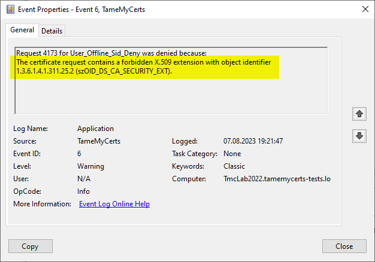

## Working with the SID certificate extension {#sid-extension}

> Applies only to **offline** certificate templates. Certificates from online certificate templates automatically get a SID certificate extension from the Windows Default policy module.

The SID certificate extension gets processed after [Rules for the Subject Distinguished Name (Subject DN)](#subject-rules) and [Rules for the Subject Alternative Name (SAN)](#san-rules), so ensure you have these configured as well. If you plan to add the SID extension from an Active Directory object to an issued certificate, you must also configure [Directory Services mapping](#ds-mapping).

> Microsoft introduced another mapping method in form of a uniformResourceIndicator in April 2023 (<https://techcommunity.microsoft.com/t5/ask-the-directory-services-team/preview-of-san-uri-for-certificate-strong-mapping-for-kb5014754/bc-p/3794144#M965>), which is also supported by TameMyCerts and can be configured within [Directory Services mapping](#ds-mapping).

The security identifier certificate extension was introduced by Microsoft with the May 2022 cumulative update for Windows Server (KB5014754) (<https://support.microsoft.com/en-us/topic/kb5014754-certificate-based-authentication-changes-on-windows-domain-controllers-ad2c23b0-15d8-4340-a468-4d4f3b188f16>). The patch causes Active Directory to require this certificate extension to process certificate-bases logons. There is a compatibility mode, which Microsoft plans to automatically disable on **February 11, 2025**.

As Microsoft only ensured that the extension will be present in certificates originating from **online** certificate templates, this probably will cause trouble when certificates originating from **offline** certificate templates (e.g. mobile devices managed by Intune, AirWatch/Workspace One, MobileIron and the like) are used for certificate-bases logons against Active Directory. A popular example is Wifi or VPN logons that use the Microsoft Network Policy Server.

TameMyCerts is able to process the new certificate extension in a
variety of ways:

- Deny requests containg the extension.

- Pass the extension as-is into the issued certificate.

- Add the extension from the properties of a mapped Active Directory object.

- Remove the extension if it is part of the originating certificate request.



### Configuring

If TameMyCerts shall process the SID certificate extension, you configure it with the **SecurityIdentifierExtension** directive within a policy configuration file.

You can configure four modes:

|Action|Description|
|---|---|
|Deny (default)|All certificate requests that contain a security identifier certificate extension will get denied if this is set.|
|Allow |If a certificate request contains a security identifier extension, it will get passed as-is into the issued certificate.|
|Add |Adds the value of the objectSid (<https://learn.microsoft.com/en-us/windows/win32/adschema/a-objectsid>) attribute of the Active Directory object belonging to the certificate request to the issued certificate. Can therefore only be used in combination with [Directory Services mapping](#ds-mapping).|
|Remove |If a certificate request contains a security identifier extension, it will not get passed into the issued certificate.|

> If you configure TameMyCerts to add the SID certificate extension, you should ensure that the resulting certificate will contain a Subject Alternative Name of type _dNSName_ (for mapped computer objects) or _userPrincipalName_ (for mapped user objects) as this will be used to map the certificate to the AD object during authentication. You can either achieve this by having the field being put into the certificate request (and [governing requested certificate content](#san-rules)), or [add the Subject Alternative Name from Active Directory](#modify-san) via [Directory Services mapping](#ds-mapping).

### Examples

All certificate requests that contain a security identifier certificate extension will get denied.

```xml
<SecurityIdentifierExtension>Deny</SecurityIdentifierExtension>
```

All certificate requests that contain a security identifier certificate extension will get allowed and the resulting certificate will contain the requested SID extension.

```xml
<SecurityIdentifierExtension>Allow</SecurityIdentifierExtension>
```

All certificate requests that contain a security identifier certificate extension will get allowed and the resulting certificate will **not** contain the requested SID extension

```xml
<SecurityIdentifierExtension>Remove</SecurityIdentifierExtension>
```

All certificate requests get the SID extension built from a mapped Active directory object (requires [Directory Services mapping](#ds-mapping) to be configured).

```xml
<SecurityIdentifierExtension>Add</SecurityIdentifierExtension>
```
