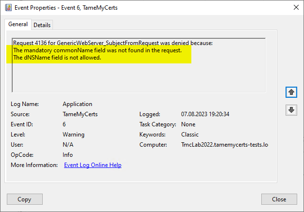
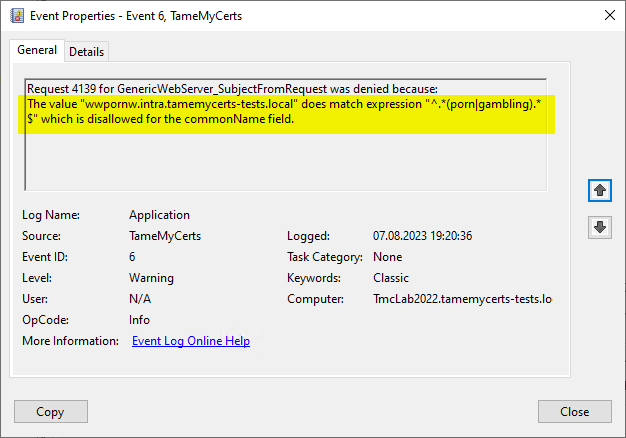
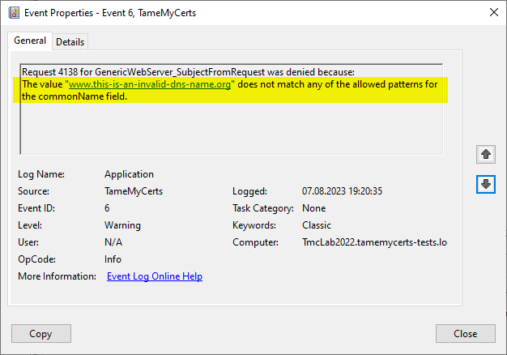
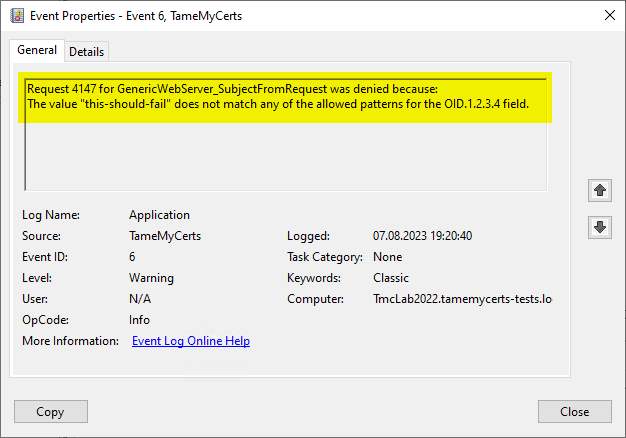

## Configuring rules for the Subject Distinguished Name of a CSR {#subject-rules}

> Applies only to **offline** certificate templates.

TameMyCerts allows to take control about which certificate content can be requested via an "offline" certificate template.

You can apply the following rules:

- Ensure that a specific field is present in the Subject DN.
- Ensure that a specific field is present only a specified number of times (usually once).
- Ensure that a specific field contains a value, or that the value does not exceed a specific length.
- Allow optional fields in the Subject DN (but not enforce them).
- Ensure that a specific field conforms to one or more regular expression.
- Ensure that a specific field conforms to one or more Classless Inter-Domain Routing (CIDR) mask ,if the field content is an Internet Protocol (IP) address.







### Configuring

Rules for Subject RDNs get specified within a "SubjectRule" node under "Subject" section.

Any Subject RDN that is not defined is considered forbidden and will result in any certificate request containing it getting denied.

A "SubjectRule" can/must contain the following nodes:

|Parameter|Mandatory|Description|
|---|---|---|
|Field|**yes**|Specifies the type of the certificate field. See the below list for possible values. **Please be aware that this parameter is interpreted case-sensitive.**|
|Mandatory|no|Specifies if this field **must** (true) or **may** (false) appear in the certificate request presented. Defaults to "false".|
|MaxOccurrences|no|Specifies how often this field may appear within a certificate request. Should always be 1 for must Subject RDN types. Defaults to 1. Note that more than one field of same type can only be used when the [ReadSubjectFromRequest](#subject-from-request) directive is set to _true_.|
|MinLength|no|Specifies the minimum amount of characters the field must contain, to avoid empty RDNs being requested. Defaults to 1. Note that you also can define minimum lengths for parts or the entire field content via regular expressions in the Patterns directive.|
|MaxLength|no|Specifies the maximum amount of characters the field may contain. Defaults to 128. Note that there is also an upper limit set by the certification authority (<https://learn.microsoft.com/en-us/windows/win32/seccrypto/name-properties>). Also note that you also can define maximum lengths for parts or the entire field content via regular expressions in the Patterns directive.|
|Patterns|**yes**|For any field type you can define one or more "Pattern" directives describing expressions of which the requested field content must match at least one of to get either permitted or denied. The node is required, so if you would want to allow any content, simply configure a Pattern directive with "^.*$" as expression. For instructions on how to configure the _Patterns_ directive, consult the [Pattern](#pattern) section within the [Technical Reference](#tech-reference) chapter of this document.|

To define a policy for one or more subject Relative Distinguished Name (RDN) types, adjust the "field" to one of the following (as defined in ITU-T X.520 (<https://www.itu.int/itu-t/recommendations/rec.aspx?rec=X.520>) and IETF RFC 4519 (<https://datatracker.ietf.org/doc/html/rfc4519#section-2>)).

> Each RDN type can only be defined once in a policy definition file! Though you may specify that a certificate request contains more than one RDN of the same type, you would have to specify the criteria for all of them in the same rule. It is advised to allow each RDN type only once in a certificate request.

The following RDN types are enabled/allowed by default on AD CS and are therefore useable with TameMyCerts:

- countryName
- commonName
- domainComponent
- emailAddress
- organizationName
- organizationalUnitName
- localityName
- stateOrProvinceName

The following RDNs can additionally be defined in a policy configuration but must explicitly be enabled in the certification authority configuration by modifying its _SubjectTemplate_ registry value (<https://learn.microsoft.com/en-us/windows/win32/seccrypto/name-properties>):

- givenName
- initials
- surname
- streetAddress
- title
- unstructuredName
- unstructuredAddress
- serialNumber

> Please be aware that the _SubjectTemplate_ registry value of the CA uses a different syntax for field type names than AD CS does.

> Under certain circumstances, it is also possible to [modify the Subject Distinguished Name (DN)](#modify-subject-dn) using values from a [mapped Active Directory object](#ds-mapping) or from [static values](#modify-subject-dn-static).

### Examples

Incoming requests **must** contain exactly one _commonName_ which must be a DNS-Name beneath the _tamemycerts.com_ Domain. The whole content may not be longer than 64 characters in total.

```xml
<Subject>
  <SubjectRule>
    <Field>commonName</Field>
    <Mandatory>true</Mandatory>
    <MaxLength>64</MaxLength>
    <Patterns>
      <Pattern>
        <Expression>^[-_a-zA-Z0-9]*\.tamemycerts\.com$</Expression>
      </Pattern>
    </Patterns>
  </SubjectRule>
</Subject>
```

Incoming requests **must** contain exactly one _commonName_ which must be a DNS-Name beneath the _tamemycerts.com_ Domain. The whole content may not be longer than 64 characters in total. It may not contain the blacklisted words "porn" or "gambling".

```xml
<Subject>
  <SubjectRule>
    <Field>commonName</Field>
    <Mandatory>true</Mandatory>
    <MaxLength>64</MaxLength>
    <Patterns>
      <Pattern>
        <Expression>^[-_a-zA-Z0-9]*\.tamemycerts\.com$</Expression>
      </Pattern>
      <Pattern>
        <Expression>^.*(porn|gambling).*$</Expression>
        <Action>Deny</Action>
      </Pattern>
    </Patterns>
  </SubjectRule>
</Subject>
```

Incoming requests **must** contain exactly one _commonName_ which must be a DNS-Name beneath the _tamemycerts.com_ Domain. It also **may** contain exactly one _countryName_ but if so, it must be "DE" or "US".

```xml
<Subject>
  <SubjectRule>
    <Field>commonName</Field>
    <Mandatory>true</Mandatory>
    <MaxLength>64</MaxLength>
    <Patterns>
      <Pattern>
        <Expression>^[-_a-zA-Z0-9]*\.tamemycerts\.com$</Expression>
      </Pattern>
    </Patterns>
  </SubjectRule>
  <SubjectRule>
    <Field>countryName</Field>
    <Mandatory>false</Mandatory>
    <Patterns>
      <Pattern>
        <Expression>^(DE|US)$</Expression>
      </Pattern>
    </Patterns>
  </SubjectRule>
</Subject>
```

### Optional: Working with non-Standard Relative Distinguished Names {#subject-from-request}

> You should use this only if there is a definitve requirement to do so. Avoid using it in any other case.

Processing certificate requests with RDNs that are not part of the default set requires enabling the **CRLF\_REBUILD\_MODIFIED\_SUBJECT\_ONLY** flag (<https://www.gradenegger.eu/en/use-of-undefined-relative-distinguished-names-rdn-in-issued-certificates/>) on the certification authority, which should be used with extreme caution.

A common use case for this feature is supporting the requirements of eIDAS in form of adding an organization identifier (OI) to a certificate request and thus to an issued certificate.

> This mode may have trouble with malformed certificate requests. 

By default, TameMyCerts will use the data from the record provided by the certification authority ("how the certificate would get issued") to analyze the Subject Distinguished Name. This allows for best compatibility and security, but has its drawbacks. The certification authority design assumes that there is only a specific set of field types and that there is only one per type.

If you have the need to inspect Subject Relative Distinguished Names that are not part of the default set, you can instruct TameMyCerts to parse the Subject Distinguished Name from the original certificate request ("how the certificate was originally requested") by setting the **ReadSubjectFromRequest** directive.

```xml
<ReadSubjectFromRequest>true<ReadSubjectFromRequest>
```

Now, the following additional RDNs can be used in a subject rule:

- postalCode

- description

- postOfficeBox

- telephoneNumber

- any other "unknown" (not part of the standard set or described above) RDN can be specified in a subject rule by using its object identifier (OID). The OID must be specified with an "OID." prefix, e.g. "OID.1.2.3.4".


