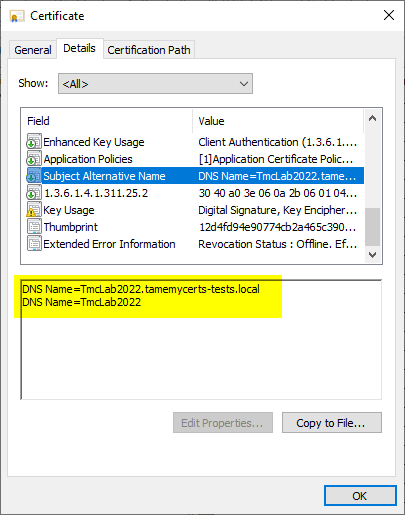

## Supplementing Service Principal Names from mapped Active Directory objects {#supplement-spns}

> Applies to **online** and **offline** certificate templates.
> Requires [Directory Services Mapping](#ds-mapping) to be enabled.

TameMyCerts can add DNS names found in the Service Principal Names (<https://learn.microsoft.com/en-us/windows/win32/ad/service-principal-names>) (SPNs) of mapped AD objects to the Subject Alternative Name (SAN) extension of issued certificates.

This allows to automatically add aliases and custom names required for Kerberos authentication to issued certificates.



> This feature might be dangerous in cases there are no strict controls about how SPNs are registered for your AD accounts. Please use the feature carefully!

> As the Service Principal Names (SPNs) usually also contain the non-qualified hostname of a machine, this identity gets added to the SAN as well.

### Configuring

You enable the feature by configuring **SupplementServicePrincipalNames** directive.

```xml
<DirectoryServicesMapping>
  <!-- other directives have been left out for simplicity -->
  <SupplementServicePrincipalNames>true</SupplementServicePrincipalNames>
</DirectoryServicesMapping>
```
