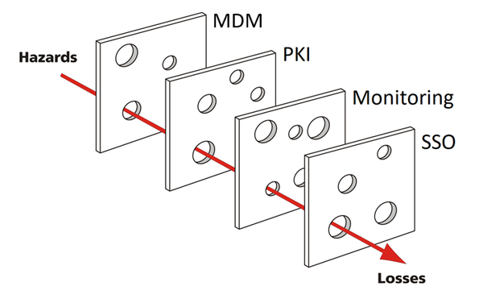
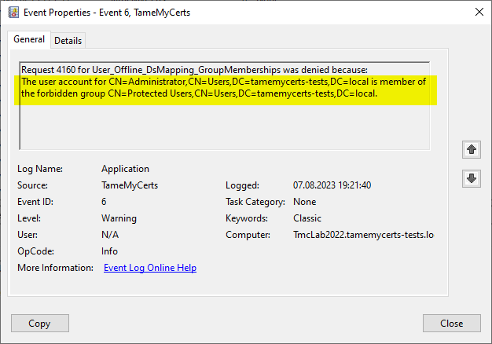

### How TameMyCerts can secure mobile device deployments with Microsoft Intune and similar MDM systems {#uc-dsmapping}

Enterprise use Mobile Device Management (MDM) products to provision and manage their mobile devices like smartphones, tablet computers or even entire desktop computers, over-the-air (OTA).

Common MDM products include:

- Microsoft Intune
- VMware Workspace One (previously known as _AirWatch_)
- Ivanti MobileIron UEM
- Jamf Pro
- Baramundi Enterprise Mobility Management
- BlackBerry Enterprise Mobility Suite
- Sophos Mobile Control
- SOTI MobiControl

All these systems follow a similar concept: They act as an intermediary between the managed device, the coprorate directory service, and the certification authority. All of them provide some kind connector to submit certificate requests to a Microsoft AD CS certification authority.

> Microsoft Intune uses the Network Device Enrollment Service (NDES) (<https://learn.microsoft.com/en-us/windows-server/identity/ad-cs/network-device-enrollment-service-overview>) role as a connector between Intune and the certification authority. NDES, like the certificaton authority, allows for custom-developed policy modules. Microsoft provides a policy module for NDES in combination with Intune, therefore it is not possible to add another policy module to an Intune-enabled NDES instance. However, TameMyCerts, as it resides on the CA, can coexist perfectly well with an Intune-enabled NDES instance, including the Intune policy module there.

All MDM systems require the certificate template to be configured as an _offline_ certificate template. This means that the certification authority **must** accept _any identity_ contained in a certificate request. Furthermore, all certificate requests are submitted to the certification authority using a single service account. If this account is compromised or otherwise abused, if the MDM system is misconfigured or has a software flaw, the certification authority **will issue** virtually _any possible identity_, including those of the CEO or highly privileged system accounts and administrators, which can lead to a variety of security disasters.

The default deployment with a Microsoft Certification Authority using Active Directory Certificate Services makes the whole setup vulnerable to the Swiss Cheese Model (see <https://en.wikipedia.org/wiki/Swiss_cheese_model> for futrher information), in which all participating layers having a small flaw, which in combinations allow disasters to happen.

TameMyCerts can restrict the requested certificate content to precisely-defined certificate fields as well as apply syntax rules to these. In addition, TameMyCerts is able to map requested identities back to their underlying Active Directory objects and can decide whether a certificate shall be issued based on enablement status, group memberships and other criteria.

