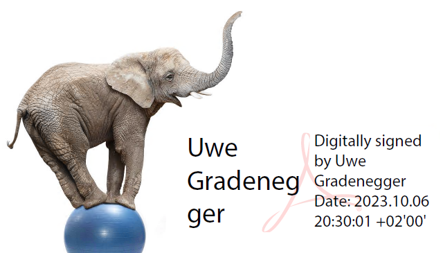
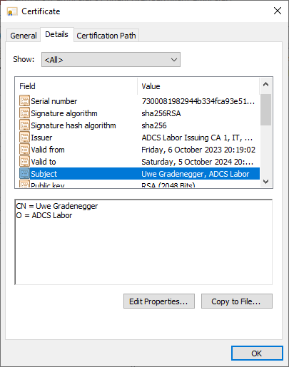

### How TameMyCerts can help establish digital signature processes in the enterprise {#uc-subjectdn}

Many enterprises nowadays want to establish paperless processes to ease and speed up internal approval and signature processes. This has become even more important in the times of employees predominantly working remotely. Whilst Microsoft AD CS is capable of automating certificate issuance processes, its possibilities to influence the certificate content are limited.

TameMyCerts allows to define advanced rules to build the Subject Distinguished names or Subject Alternative Names with either statically defined values, or by pulling the necessary data from Active Directory. This drastically extends the possibilities of certificate Autoenrollment in the Windows ecosystem.

For example, you could populate a certificates Common Name with the _displayName_ Active Directory attribute and set a static value for the _organizationName_ field as well.

