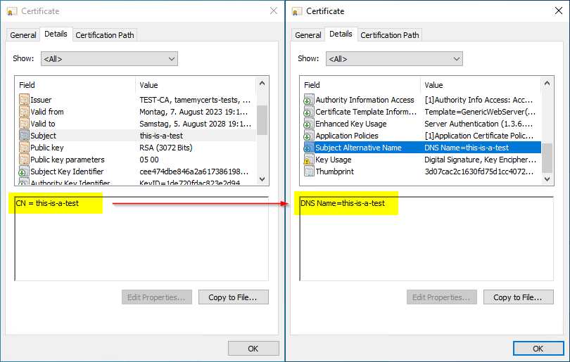

### How TameMyCerts can repair incoming certificate requests to make them RFC-compliant {#uc-supplement-dns}

Beginning with Version 58, Google decided to remove the support for certificates containing only a Subject Distinguished Name (Subject DN) (<https://developer.chrome.com/blog/chrome-58-deprecations/#remove-support-for-commonname-matching-in-certificates>). From thereon, certificates not containing a Subject Alternate Name in form of a DNS name were treated as invalid by Google Chrome. Soon, other major browser vendors adopted this approach.

This behavior is in compliance to the IETF RFC 2818 (<https://tools.ietf.org/html/rfc2818>) dating back to the year 2000. Certificates for web servers must therefore use the Subject Alternative Name (SAN) for their identity. Sadly, there are still a lot of products in use that are not capable of creating a Certificate Signing Request containing a SAN in form of a DNS name.

Sadly, many HowTos on the web instruct CA administrators to enable the **EDITF\_ATTRIBUTESUBJECTALTNAME2** flag on their CAs in the belief this would enable them the issuance of SANs for certificate requests not containine one. However, doing so opens a large security hole, as this setting allows **anyone** to request **any identity** for **any certificate template** published on the certification authority.

Luckily, there are better ways to reach the intended goal.

With TameMyCerts, there is a secure, yet automatic method available to fix those certificates without the need of enabling insecure flags on the CA. TameMyCerts [can be instructed to transfer the content of the Subject Distinguished Name into a Subject Alternative Name (SAN) extension prior to issuing the certificate](#supplement-dns-names). Furthermore, TameMyCerts [ensures that attempts to abuse the certification authority are detected and such requests wil get denied](#uc-esc6), should an insecure flag still be enabled.

