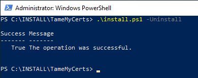

## Uninstalling the TameMyCerts policy module {#uninstalling}

To uninstall the module, run **install.ps1** as Administrator. You must specify the **-Uninstall** parameter.

> The installation script restarts the certification authority service during installation and uninstallation.

Example:

```powershell
.\Install.ps1 -Uninstall
```



The script will unregister the module, copy the registry settings back and configure the Windows Default policy module as the active one.
