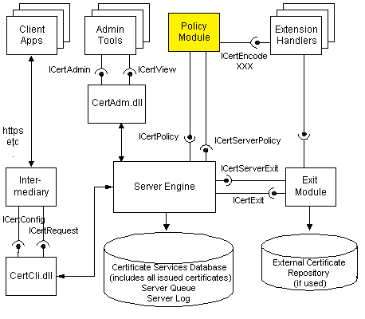

# What is TameMyCerts and why would you need it? {#why}

TameMyCerts is a policy module for Microsoft Active Directory Certificate Services (AD CS) enterprise certification authorities that enables security automation for a lot of use cases in the PKI field.

It is developed in germany by PKI expert Uwe Gradenegger (<https://www.gradenegger.eu/>), with contributions from all over the world.

The module supports, amongst other functions, inspecting certificate requests for certificate templates that allow the subject information to be specified by the enrollee against a defined policy. If any of the requested identities violates the defined rules, the certificate request automatically gets denied by the certification authority. Requested identities can also be mapped against Active Directory to apply restrictions based on group memberships, or even to pull certificate content from AD.

Therefore, the TameMyCerts policy module for Microsoft Active Directory Certificate Services helps you to tame your certs! It has already proven itself in countless productive deployments of enterprise-grade scale.

TameMyCerts is Open Source Software. Find it on GitHub (<https://github.com/Sleepw4lker/TameMyCerts>).

> For enterprise deployments, **commercial support** and **maintenance agreements** are being offered as well.

## The need for a policy module

Enterprises in a modern, digitalized, highly connected world strongly rely on digital certificates. Certificates are used for a variety of use cases like...

- Authentication to on-premises or cloud resources.
- Enabling remote access for users for them to be able to work remotely from anywhere, with any kind of device.
- Securing web-based transactions.
- Ensuring authenticity in electronic document workflows.

Organizations around the world rely on Microsoft Active Directory Certificate Services (AD CS) (<https://learn.microsoft.com/en-us/windows-server/identity/ad-cs/active-directory-certificate-services-overview>) for issuing digital certificates within their Microsoft identity ecosystem. Microsoft AD CS is a suite of roles provided by the Microsoft Windows Server operating system. Its main role is the certification authority (CA), which is responsible for processing certificate requests and issuing digital certificates.

The core of a digital certificate is the identity it provides. A CAs main responsibility is to verify and attest the enrollees identity. Trusting a certification authority means trusting the content of the digital certificates it is issuing and the identities it attests.

## Online and offline certificate templates

AD CS uses the concept of _certificate templates_ to define rules that shall be applied to incoming certificate requests and issued certificates.

AD CS knows of two kinds of certificate templates and requests:

- **Online** certificate templates and requests: Identities in the issued certificate are determined by the certification authority, based on information on the enrollee which is pulled from Active Directory.
- **Offline** certificate templates and requests: Identities in the issued certificate are provided by the enrollee during the enrollment process. The certification authority has no control over it, allowing enrollees to virtually request any identity from the CA and thus putting the environment at risk for identity spoofing.

The fact whether a certificate template qualifies as online or offline derives from the settings within the "Subject" tab of the certificate template settings.

AD CS was originally designed around the Microsoft Active Directory ecosystem and as such to heavily rely on _online_ certificate templates for authentication of enrollees and ensuring their identities. 

However, many modern use cases require switching the certification authority to use offline certificate templates, where the certification authority has no control over the issued certificates content. This opens up a large surface for various attacks against the certification authority. In a worst case, the entire Active Directory environment of a company could be compromised because of an abused certification authority or certificate template (refer to <https://posts.specterops.io/certified-pre-owned-d95910965cd2> for further details).

## Policy modules

AD CS uses on the concept of policy modules (<https://learn.microsoft.com/en-us/windows/win32/seccrypto/certificate-services-architecture>) to determine if a certificate shall be issued. A policy module is a piece of software that is loaded into the certification authority process on start-up of the CA service. Think of it as a plug-in.

A policy module for AD CS has two main purposes:

- Modify content of issued certificates, such as determining the Subject Distringuished Name (DN) and adding extensions to an issued certificate.
- Decide whether a certificate request shall be issued, put into pending state, or get denied.

Microsoft designed AD CS in a way so that custom policy modules could be developed by individual contributors to enhance the provided functionality. TameMyCerts is such a policy module, which allows to extend the functionality that is provided by AD CS. Unique about TameMyCerts is that it is made available to the public via a free license.

## Use Cases for the TameMyCerts policy module

Refer to the [Typical use cases for the TameMyCerts policy module](#use-cases) chapter in the [Appendix]{#appendix} section of the document to learn more on typical use cases where TameMyCerts can add value.
