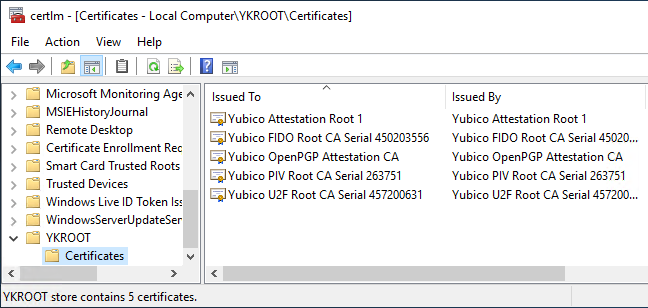
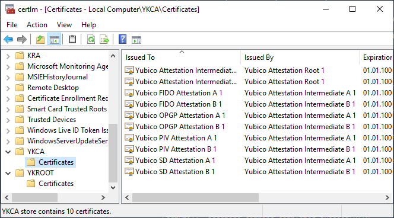

## YubiKey PIV attestation {#yubikey-piv-attestation}

> Applies to **online** and **offline** certificate templates.

> TameMyCerts YubiKey PIV attestation is the first utlizing Event Tracing for Windows (ETW) for logging. Yubikey validation will log which policy was matched in the Operations log, the entry will also include information about the YubiKey.

TameMyCerts can ensure that a key pair has been created and is secured with a Yubikey (<https://www.yubico.com/products/yubikey-5-overview/>).

This feature is called Personal Identity Verification (PIV) attestation (<https://developers.yubico.com/PIV/Introduction/PIV_attestation.html>). It can be combined with any other TameMyCerts feature.

It is possible to include the attestation certificates in the Certificate Signing Request by using any of the following means:

- yubico-piv-tool (<https://developers.yubico.com/yubico-piv-tool/>), a vendor maintained software for managing yubico PIV application.
- powershellYK (<https://github.com/virot/powershellYK>), a PowerShell 7 module that builds on the Yubico .NET SDK. Available on Windows and MacOS.
- onboardYK (<https://github.com/virot/onboardYK>), a .NET 8 application for easy enrollment in a Windows environment. It allows for default for endusers and more advanced configurations.

### Preparing the certification authority for Yubikey PIV attestation

For the attestation certificate chain to be properly built, you must create a `YKROOT` certificate store under the `LocalMachine` certificate store on the certification authority server.

```powershell
cd Cert:\LocalMachine
New-Item -Name YKROOT
New-Item -Name YKCA
```

Any Yubikey attestation Root CA certificates must be imported into the `YKROOT` certificate store.

```powershell
Get-ChildItem -Path *.cer | ForEach-Object -Process { certutil -addstore YKROOT $_.FullName }
```



Any Yubikey intermediate CA certificates must be imported into the `YKCA` certificate store (only applies to Yubikeys with Firmware 5.7.4 or newer).

```powershell
Get-ChildItem -Path *.cer | ForEach-Object -Process { certutil -addstore YKCA $_.FullName }
```



> Note that these might need to get updated during the lifetime of the certification authority, as the vendor might introduce devices signed with newer CA certificates.

### Configuring

You define a **YubiKeyPolicies** directive containing one or more **YubiKeyPolicy** rules.

|Parameter|Mandatory|Description|
|---|---|---|
|Action|**yes**|Specifies if this rule shall cause the certificate request to be allowed or denied, should it's conditions match. Can be `Allow` or `Deny`.|
|PinPolicy|no|Specifies which PIN policy must be configured on the Yubikey for the rule to match. Can be one or more of the following: `Once`, `Never`, `Always`, `MatchOnlye`, `MatchAlways`.|
|TouchPolicy|no|Specifies which Touch policy must be configured on the Yubikey for the rule to match. Can be one or more of the following: `Always`, `Never`, `Cached`.|
|FormFactor|no|Specifies of which form factor the Yubikey must be for the rule to match. Can be one or more of the following: `UsbAKeychain`, `UsbCKeychain`, `UsbANano`, `UsbCNano`, `UsbCLightning`, `UsbABiometricKeychain`, `UsbCBiometricKeychain`.|
|MaximumFirmwareVersion|no|Specifies the maximum Firmware version the Yubikey must have for the rule to match.|
|MinimumFirmwareVersion|no|Specifies the minimum Firmware version the Yubikey must have for the rule to match.|
|Edition|no|Specifies of which edition the Yubikey must be for the rule to match. Can be one or more of the following: `FIPS`, `Normal`, `CSPN`.|
|Slot|no|Specifies the Slot under which the certificate request must be stored under for the rule to match. Can be one or more of the following: `9a`, `9c`, `9d`, `9e`.|
|KeyAlgorithm|no|Specifies the Key Algorithm of which the certificate request must be for the rule to match. Can be one or more of the following: `RSA`, `ECC`.|

The YubiKeyPolicies are read one by one.

- If there is **any** policy with `Allow` action, the default behavior if no rule matched is to **deny** the certificate request.
- If **all** policies are of `Deny` action, the default behavior if no rule matched is to **allow** the certificate request.
- Alternating Deny and Allow policies is allowed. In this case, for a certificate request to get allowed, **at least one** of the policy with `Allow` action must match, whereas **none** of the policies with `Deny` action must match.

### Creating certificate requests

> This is only an example. Refer to the vendor's documentation (<https://developers.yubico.com/yubico-piv-tool/>) for more information on how to use the tool.

Certificate requests can be created in various ways. Here is an example using the Yubikey PIV Tool.

First, a key pair has to be created. This will save the public key into a file named `pubkey.key`.

```batch
yubico-piv-tool --slot=9a --action=generate --pin-policy=once --touch-policy=cached --algorithm=ECCP384 --output=pubkey.key
```

Afterwards, a Certificate Signing Request can be created using the public key. It will be saved into a file called `request.csr`.

```batch
yubico-piv-tool --slot=9a --subject="/CN=this-is-a-test/" --input=pubkey.key --attestation --output=request.csr --action=verify-pin --action=request
```

### Transferring PIV attestation data into issued certificates

Attestation Information can be [written into the Subject Distinguished Name](#modify-subject-dn) of the issued certificates using the following tokens:

- `yk:FormFactor`
- `yk:FirmwareVersion`
- `yk:PinPolicy`
- `yk:TouchPolicy`
- `yk:Slot`
- `yk:SerialNumber`

### Attesting the PIV attestation in issued certificates

TameMyCerts will transfer the following certificate extensions from the Yubikey attestation certificate into the issued certificate (if present in the attestation certificate):

|Extension OID|Description|
|---|---|
|1.3.6.1.4.1.41482.3.3|Firmware version, encoded as 3 bytes, like: 040300 for 4.3.0|
|1.3.6.1.4.1.41482.3.7|Serial number of the YubiKey, encoded as an integer.|
|1.3.6.1.4.1.41482.3.8|Two bytes, the first encoding pin policy (01 - never, 02 - once per session, 03 - always) and the second touch policy (01 - never, 02 - always, 03 - cached for 15s)|
|1.3.6.1.4.1.41482.3.9|Formfactor, encoded as one byte: USB-A Keychain: 01 and 81 for FIPS Devices, USB-A Nano: 02 and 82 for FIPS Devices, USB-C Keychain: 03 and 83 for FIPS Devices, USB-C Nano: 04 and 84 for FIPS Devices, Lightning and USB-C: 05 and 85 for FIPS Devices|
|1.3.6.1.4.1.41482.3.10|FIPS Certified YubiKey
|1.3.6.1.4.1.41482.3.11|CSPN Certified YubiKey|

It was originally intended to provide an option to include the original attestation data in issued certificates, but as Yubikeys have a size limit of 3052 bytes for issued certificates (see <https://docs.yubico.com/yesdk/users-manual/application-piv/attestation.html> for more details), this is not feasible.

If you intend to add a proof of attestation into issued certificates, do this by adding an Issuance Policy to issued certificates.

### Adding additional content to issued certificates

Not all tools that may be used to create certificate requests with PIV attestation support adding a Subject Alternative Name or, for example, do not support the Microsoft-proprietary _userPrincipalName_ SAN type. TameMyCerts can add this information by [Modifying the Subject Alternative Name of issued certificates](#modify-san). See the below section for examples.

### Examples

A simple policy that just ensures the key pair is protected with a Yubikey, without any additional requirements.

```xml
<YubiKeyPolicies>
  <YubiKeyPolicy />
</YubiKeyPolicies>
```

Denying certificate requests for ECC keys with a Yubikey with firmware version prior to 5.7.0 (these have a vulnerability, see <https://www.yubico.com/support/security-advisories/ysa-2024-03/> for more details).

```xml
<YubiKeyPolicies>
  <YubiKeyPolicy>
      <MaximumFirmwareVersion>5.6.9</MaximumFirmwareVersion>
      <KeyAlgorithm>
        <string>ECC</string>
      </KeyAlgorithm>
      <Action>Deny</Action>
  </YubiKeyPolicy>
</YubiKeyPolicies>
```

Transferring the Slot and Serial Number of the Yubikey into the _commonName_ of the issued certificate (in combination with the `cn` attribute from a [mapped](#ds-mapping) Active Directory object).

> Note that the _commonName_ [is subject to a length constraint](#modify-subject-dn) determined by Microsoft AD CS.

```xml
<YubiKeyPolicies>
  <!-- other directives have been left out for simplicity -->
</YubiKeyPolicies>
<OutboundSubject>
  <OutboundSubjectRule>
    <Field>commonName</Field>
    <Value>{ad:cn} [{yk:Slot} {yk:SerialNumber}]</Value>
    <Mandatory>true</Mandatory>
    <Force>true</Force>
  </OutboundSubjectRule>
</OutboundSubject>
```

Transferring the Serial Number of the Yubikey into the _serialNumber_ of the issued certificate.

```xml
<YubiKeyPolicies>
  <!-- other directives have been left out for simplicity -->
</YubiKeyPolicies>
<OutboundSubject>
  <OutboundSubjectRule>
    <Field>serialNumber</Field>
    <Value>{yk:SerialNumber}]</Value>
    <Mandatory>true</Mandatory>
    <Force>true</Force>
  </OutboundSubjectRule>
</OutboundSubject>
```

A policy containing all possible combinations.

```xml
<YubiKeyPolicies>
  <YubiKeyPolicy>
    <Action>Allow</Action>
    <PinPolicy>
      <string>Once</string>
      <string>Never</string>
      <string>Always</string>
      <string>MatchOnce</string>
      <string>MatchAlways</string>
    </PinPolicy>
    <TouchPolicy>
      <string>Always</string>
      <string>Never</string>
      <string>Cached</string>
    </TouchPolicy>
    <FormFactor>
      <string>UsbAKeychain</string>
      <string>UsbCKeychain</string>
      <string>UsbANano</string>
      <string>UsbCNano</string>
      <string>UsbCLightning</string>
      <string>UsbABiometricKeychain</string>
      <string>UsbCBiometricKeychain</string>
    </FormFactor>
    <MaximumFirmwareVersion>9.9.9</MaximumFirmwareVersion>
    <MinimumFirmwareVersion>0.0.0</MinimumFirmwareVersion>
    <Edition>
      <string>FIPS</string>
      <string>Normal</string>
      <string>CSPN</string>
    </Edition>
    <Slot>
      <string>9a</string>
      <string>9c</string>
      <string>9d</string>
      <string>9e</string>
    </Slot>
    <KeyAlgorithm>
      <string>RSA</string>
      <string>ECC</string>
    </KeyAlgorithm>
  </YubiKeyPolicy>
</YubiKeyPolicies>
```

Mapping the User's Active Directory identity from the _commmonName_ of the certificate to the _sAMAccountName_ of the AD object and adding the user's _userPrincipalName_ to the Subject Alternative Name of the issued certificate, after verifying PIV attestation.

```xml
<Subject>
  <SubjectRule>
    <Field>commonName</Field>
    <Mandatory>true</Mandatory>
    <Patterns>
      <Pattern>
        <Expression>^[a-zA-Z0-9]*$</Expression>
      </Pattern>
    </Patterns>
  </SubjectRule>
</Subject>
<DirectoryServicesMapping>
  <CertificateAttribute>commonName</CertificateAttribute>
  <DirectoryServicesAttribute>sAMAccountName</DirectoryServicesAttribute>
</DirectoryServicesMapping>
<YubiKeyPolicies>
  <!-- other directives have been left out for simplicity -->
</YubiKeyPolicies>
<OutboundSubjectAlternativeName>
  <OutboundSubjectRule>
    <Field>userPrincipalName</Field>
    <Value>{ad:userPrincipalName}</Value>
    <Mandatory>true</Mandatory>
  </OutboundSubjectRule>
</OutboundSubjectAlternativeName>
```
